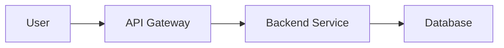

Enhance your documentation with images, videos, and other media elements to create engaging, visual content.

## Adding Images

### Using Markdown Syntax

The simplest way to add an image is with standard Markdown:

```md

```

The alt text is important for accessibility and SEO. Describe what the image shows.

<Note>
Image files must be less than 5MB. For larger files, use a CDN like [Cloudinary](https://cloudinary.com/) or [S3](https://aws.amazon.com/s3/).
</Note>

### Using HTML for More Control

For additional styling options, use HTML `` tags:

```html

```

You can add inline styles for custom sizing and styling:

```html

```

## Frame Component

Wrap images in the `<Frame>` component for consistent styling:

<Frame>
  
</Frame>

```mdx
<Frame>
  
</Frame>
```

The Frame component adds:
- Consistent border radius
- Subtle shadows
- Responsive sizing
- Light/dark mode support

### Frame with Captions

Add context to images with captions:

<Frame caption="The main dashboard showing real-time analytics">
  
</Frame>

```mdx
<Frame caption="The main dashboard showing real-time analytics">
  
</Frame>
```

## Image Organization

Store images in organized directories:

```
/images/
├── screenshots/
│   ├── dashboard.png
│   └── settings.png
├── diagrams/
│   ├── architecture.svg
│   └── workflow.png
└── logos/
    ├── logo.svg
    └── icon.png
```

<Tip>
Use descriptive filenames like `checkout-flow-step-2.png` instead of generic names like `image1.png`. This improves organization and SEO.
</Tip>

## Videos

### Embedded Videos

Embed videos from YouTube, Vimeo, or Loom using iframes:

```html
<iframe
  width="560"
  height="315"
  src="https://www.youtube.com/embed/VIDEO_ID"
  title="Video title"
  frameBorder="0"
  allow="accelerometer; autoplay; clipboard-write; encrypted-media; gyroscope; picture-in-picture"
  allowFullScreen
  style={{ width: '100%', borderRadius: '0.5rem' }}
></iframe>
```

### Video Component

Use Mintlify's Video component for better integration:

```mdx
<Video src="https://www.youtube.com/embed/VIDEO_ID" />
```

Or with custom sizing:

```mdx
<Frame>
  <Video src="https://www.youtube.com/embed/VIDEO_ID" />
</Frame>
```

## Image Best Practices

<AccordionGroup>
  <Accordion title="Optimize image sizes" icon="gauge">
    - Use appropriate dimensions (don't upload 4K images for small thumbnails)
    - Compress images with tools like [TinyPNG](https://tinypng.com/)
    - Use modern formats like WebP when possible
    - Keep images under 5MB or use a CDN
  </Accordion>

  <Accordion title="Use descriptive alt text" icon="text">
    - Describe what the image shows, not just "screenshot"
    - Include relevant keywords naturally
    - Keep it concise but informative
    - Example: "User dashboard showing analytics graphs and recent activity"
  </Accordion>

  <Accordion title="Choose the right format" icon="image">
    - **PNG**: Screenshots, images with text, transparent backgrounds
    - **JPG**: Photos, images with many colors
    - **SVG**: Logos, icons, diagrams (scalable)
    - **GIF**: Simple animations (use sparingly)
    - **WebP**: Modern format with better compression
  </Accordion>

  <Accordion title="Support light and dark modes" icon="moon">
    - Test images in both themes
    - Use transparent backgrounds when possible
    - Consider providing theme-specific versions
    - Avoid pure white or black backgrounds
  </Accordion>
</AccordionGroup>

## External Images

Reference images from CDNs or external sources:

```md

```

<Warning>
External images may break if the source URL changes. For critical images, host them in your repository.
</Warning>

## Diagrams and Charts

For technical diagrams, consider:

- **SVG files**: Scalable and crisp at any size
- **Mermaid diagrams**: Create diagrams with code (check Mintlify's Mermaid support)
- **Lucidchart/Figma**: Export as SVG or PNG



## Image Galleries

Display multiple images using CardGroup:

<CardGroup cols={2}>
  <Card>
    <Frame>
      
    </Frame>
  </Card>
  <Card>
    <Frame>
      
    </Frame>
  </Card>
</CardGroup>

```mdx
<CardGroup cols={2}>
  <Card>
    <Frame>
      
    </Frame>
  </Card>
  <Card>
    <Frame>
      
    </Frame>
  </Card>
</CardGroup>
```

## Accessibility

<CardGroup cols={2}>
  <Card title="Always include alt text" icon="universal-access">
    Every image should have meaningful alt text for screen readers and SEO.
  </Card>
  <Card title="Use semantic HTML" icon="code">
    Prefer `` tags over background images for content.
  </Card>
  <Card title="Ensure sufficient contrast" icon="circle-half-stroke">
    Test images against both light and dark backgrounds.
  </Card>
  <Card title="Provide text alternatives" icon="file-lines">
    For complex diagrams, include a text description or table.
  </Card>
</CardGroup>

## Troubleshooting

<AccordionGroup>
  <Accordion title="Image not displaying" icon="triangle-exclamation">
    - Check the file path is correct (use root-relative paths like `/images/file.png`)
    - Verify the image exists in your repository
    - Ensure the file extension matches (case-sensitive on some systems)
    - Check if the file size exceeds 5MB
  </Accordion>

  <Accordion title="Image quality is poor" icon="image">
    - Upload higher resolution images
    - Use PNG for screenshots instead of JPG
    - Avoid excessive compression
    - Use SVG for logos and diagrams
  </Accordion>

  <Accordion title="Images load slowly" icon="clock">
    - Compress images before uploading
    - Use a CDN for large media files
    - Consider lazy loading for image-heavy pages
    - Optimize image dimensions
  </Accordion>
</AccordionGroup>
